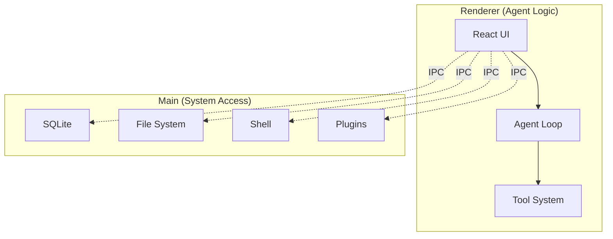

<p align="center">
  <a href="https://github.com/AIDotNet/OpenCowork">
    
  </a>
  <h1 align="center">OpenCowork</h1>
  <p align="center">
    <strong>Open-source desktop platform for multi-agent collaboration</strong><br>
    Empowering AI agents with local tools, parallel teamwork, and seamless workplace integration.
  </p>
</p>

<!-- 📸 PROJECT BANNER / SCREENSHOT PLACEHOLDER -->
<p align="center">
  
  <br>
</p>

<p align="center">
  <a href="README.zh.md">中文文档</a> •
  <a href="#why-opencowork">Why OpenCowork</a> •
  <a href="#key-features">Features</a> •
  <a href="#inspiration">Inspiration</a> •
  <a href="#quick-start">Quick Start</a>
</p>

<p align="center">
  
  
  
  
  
</p>

---

## 🚀 Why OpenCowork?

Traditional LLM interfaces are often "environment-isolated islands." Developers spend 50% of their time copy-pasting code, terminal logs, and file contents between the chat and their IDE.

**OpenCowork solves this by providing:**

- **Local Agency:** Agents can directly read/write files and execute shell commands with your permission.
- **Context Awareness:** No more manual context feeding. Agents explore your codebase and logs autonomously.
- **Task Orchestration:** Complex tasks (like "Refactor this module and update tests") are broken down and handled by specialized sub-agents.
- **Human-in-the-loop:** You stay in control with a transparent tool-call approval system.

## 💡 Inspiration

OpenCowork is deeply inspired by **Claude CoWork**. We believe the future of productivity lies in a "Co-Working" relationship where humans provide direction and AI handles the iterative execution, tool manipulation, and cross-platform communication.

## ✨ Key Features

- **Multi-Agent Loop:** A lead agent coordinates parallel teammates to tackle multi-dimensional problems.
- **Native Toolbox:** Built-in tools for File I/O, PowerShell/Bash, Code Search, and UI Previews.
- **Messaging Integration:** Bridge your local agents to Feishu/Lark, DingTalk, Discord, and more.
- **Persistence:** Cron-based scheduling for automated daily reports or monitoring tasks.
- **Extensible Skills:** Load custom logic via simple Markdown-defined skills and agents.

## 🛠️ Quick Start

Prerequisites:

- Node.js >= 18
- npm >= 9

```bash
git clone https://github.com/AIDotNet/OpenCowork.git
cd OpenCowork
npm install
npm run dev
```

## 🏗️ Architecture Overview

OpenCowork follows a three-process Electron architecture to ensure security and performance.



## 🌟 Use Cases

- **Autonomous Coding:** Let agents refactor code, fix bugs, and write tests directly in your workspace.
- **Automated Ops:** Schedule agents to monitor logs or system status and report to Feishu/Slack.
- **Data Research:** Agents can scrape web data, process local CSVs, and generate visual reports.

## 📈 Star History

[](https://star-history.com/#AIDotNet/OpenCowork&Date)

## 🤝 Contributing

We welcome contributions! Please see our [Development Guide](docs/development.md) for more details.

## 💝 Sponsors

- [lchlfe@hotmail.com](mailto:lchlfe@hotmail.com)
- [caomaohanfengZT](https://github.com/caomaohanfengZT)
- [struggle3](https://github.com/struggle3)

## 📜 License

Licensed under the [Apache License 2.0](LICENSE).

---

<div align="center">

If this project helps you, please give it a star. ⭐

Made with ❤️ by the **AIDotNet** Team

</div>
