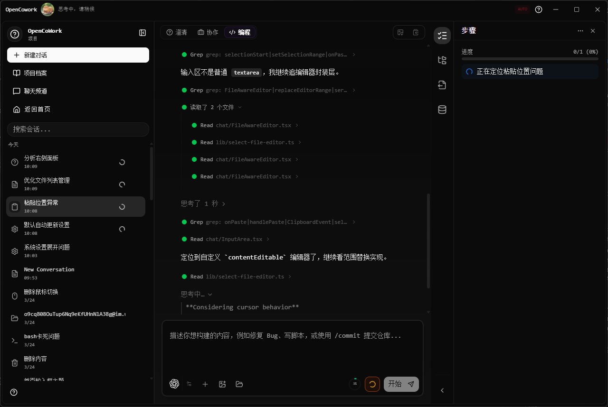
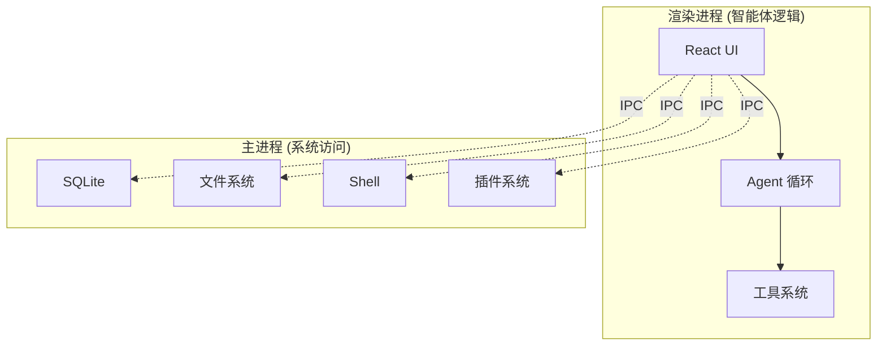

<p align="center">
  <a href="https://github.com/AIDotNet/OpenCowork">
    
  </a>
  <h1 align="center">OpenCowork</h1>
  <p align="center">
    <strong>开源桌面多智能体协作平台</strong><br>
    为 AI 智能体赋予本地工具、并行团队协作及无缝办公集成能力。
  </p>
</p>

<p align="center">
  
  <br>
</p>

<p align="center">
  <a href="README.md">English</a> •
  <a href="#为什么选择-opencowork">为什么选择 OpenCowork</a> •
  <a href="#核心特性">核心特性</a> •
  <a href="#灵感来源">灵感来源</a> •
  <a href="#快速开始">快速开始</a>
</p>

<p align="center">
  
  
  
  
  
</p>

---

## 🚀 为什么选择 OpenCowork？

传统的 LLM 界面往往是“环境孤岛”。开发者通常需要花费 50% 的时间在聊天窗口和 IDE 之间手动复制粘贴代码、终端日志和文件内容。

**OpenCowork 通过以下方式解决这一问题：**

- **本地代理能力：** 智能体可以在您的许可下直接读写文件并执行 Shell 命令。
- **上下文感知：** 无需再手动喂数据。智能体会自主探索您的代码库和日志。
- **任务编排：** 复杂的任务（如“重构此模块并更新测试”）会被拆解并由专门的子智能体处理。
- **人在回路：** 通过透明的工具调用审批系统，您始终拥有最终控制权。

## 💡 灵感来源

OpenCowork 的灵感深受 **Claude CoWork** 的启发。我们相信，生产力的未来在于“协作（Co-Working）”关系——由人类提供方向，AI 负责迭代执行、工具操作以及跨平台沟通。

## ✨ 核心特性

- **多智能体循环：** 主智能体协调并行队友，攻克多维度复杂问题。
- **原生工具箱：** 内置文件 I/O、PowerShell/Bash、代码搜索及 UI 预览工具。
- **消息平台集成：** 将本地智能体连接至飞书、钉钉、Discord 等办公软件。
- **持久化任务：** 基于 Cron 的调度系统，用于自动化日报或监控任��。
- **可扩展技能：** 通过简单的 Markdown 定义即可加载自定义逻辑和智能体。

## 🛠️ 快速开始

环境要求：

- Node.js >= 18
- npm >= 9

```bash
git clone https://github.com/AIDotNet/OpenCowork.git
cd OpenCowork
npm install
npm run dev
```

## 🏗️ 架构概览

OpenCowork 采用三进程 Electron 架构，兼顾安全与性能。



## 🌟 使用场景

- **自主编程：** 让智能体直接在您的工作区重构代码、修复 Bug 并编写测试。
- **自动化运维：** 调度智能体监控日志或系统状态，并汇报至飞书/Slack。
- **数据调研：** 智能体可以抓取网页数据、处理本地 CSV 并生成可视化报告。

## 📈 Star 历史

[](https://star-history.com/#AIDotNet/OpenCowork&Date)

## 🤝 参与贡献

我们欢迎任何形式的贡献！请参阅我们的 [开发指南](docs/development.md) 了解更多细节。

## 💝 赞助商

- [lchlfe@hotmail.com](mailto:lchlfe@hotmail.com)
- [caomaohanfengZT](https://github.com/caomaohanfengZT)
- [struggle3](https://github.com/struggle3)

## 📜 许可证

本项目采用 [Apache License 2.0](LICENSE) 开源协议。

---

<div align="center">

如果这个项目对您有帮助，请点亮一颗 Star ⭐

由 **AIDotNet** 团队倾情打造 ❤️

</div>
