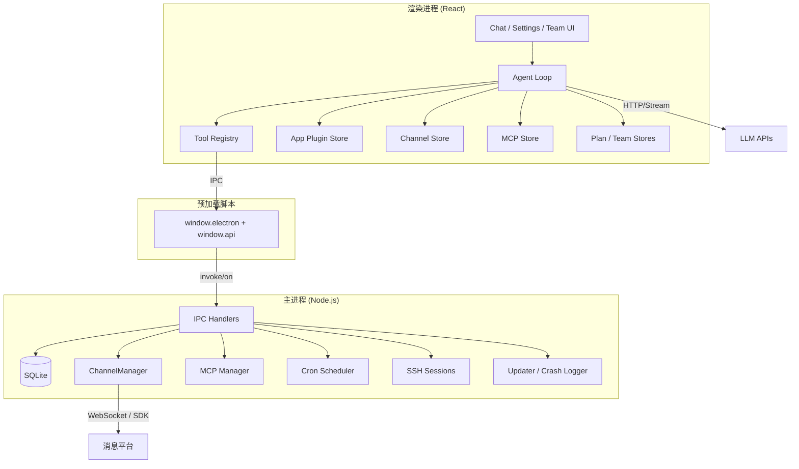

# 整体架构概述 / Architecture Overview

OpenCowork 采用 Electron 的三层结构：主进程负责系统能力与持久化，渲染进程负责 UI 与 Agent 编排，预加载脚本只暴露受控桥接 API。

## 架构图 / Architecture Diagram

## 模块职责 / Module Responsibilities

### 主进程 (`src/main/`)

| 模块 | 职责 |
| --- | --- |
| `index.ts` | 创建窗口、系统托盘、注册全部 IPC 处理器、启动托管服务 |
| `ipc/` | 文件系统、数据库、插件、MCP、Cron、SSH、通知、搜索等 IPC 域 |
| `channels/` | 消息平台插件抽象、`ChannelManager`、自动回复与平台适配器 |
| `cron/` | 定时任务调度与持久化执行 |
| `db/` | SQLite 初始化与数据访问 |
| `mcp/` | MCP 服务器生命周期管理 |
| `ssh/` | SSH 会话管理与终止 |
| `image/` | 图像相关主进程能力 |
| `updater.ts` / `crash-logger.ts` | 自动更新与崩溃记录 |

### 预加载脚本 (`src/preload/`)

| 模块 | 职责 |
| --- | --- |
| `index.ts` | 通过 `contextBridge` 暴露 `window.electron` 与 `window.api` |
| `index.d.ts` | 约束渲染进程可见的桥接类型 |

### 渲染进程 (`src/renderer/src/`)

| 模块 | 职责 |
| --- | --- |
| `lib/agent/` | Agent Loop、上下文压缩、团队协作、子代理 |
| `lib/agent/tool-registry.ts` | 工具统一注册与动态注入 |
| `lib/app-plugin/` | 应用插件与桌面控制 / 图像工具编排 |
| `lib/channel/` | 消息平台侧工具与自动回复路由 |
| `lib/mcp/` | MCP 工具注册与连接管理 |
| `stores/` | chat、agent、channel、app-plugin、mcp、plan、team、ui 等 Zustand store |
| `hooks/` | 聊天交互与生命周期 Hooks |

## 数据流 / Data Flow

1. 用户在 UI 输入消息
2. `chat-store` 持久化会话状态到 SQLite（通过 IPC）
3. `agent-store` 启动 Agent Loop 并构建系统提示
4. Agent 直接调用 LLM API，流式返回文本/思考/工具事件
5. 需要本地能力时，工具通过 IPC 或桥接 API 执行
6. 结果回写 UI，并在需要时同步到消息平台或定时任务执行链
