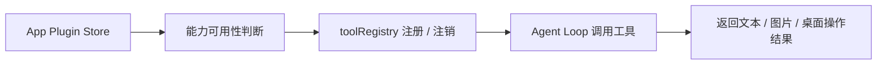

# 应用插件 / App Plugins

应用插件是 OpenCowork 的内置能力扩展层，用来给 Agent 动态注入额外工具。它和消息平台插件不同：应用插件不连接外部聊天平台，而是直接增强本地 Agent 的能力。

当前内置能力有两类：

- **图像生成插件**：公开可用，为 Agent 提供 `ImageGenerate`
- **桌面控制插件**：内置但隐藏，提供截图 / 点击 / 输入 / 滚动 / 等待等工具

## 运行方式 / How It Works

`src/renderer/src/lib/app-plugin/index.ts` 会根据 `useAppPluginStore` 的状态动态注册工具：

- 图像插件可用时，注册 `ImageGenerate`
- 桌面控制插件可用时，注册 `DesktopScreenshot`、`DesktopClick`、`DesktopType`、`DesktopScroll`、`DesktopWait`

## 图像生成插件 / Image Plugin

图像生成插件为 Agent 提供 `ImageGenerate` 工具，允许 Agent 根据用户请求生成图片。

### 配置步骤

1. 进入 **设置 → AI 提供商**
2. 启用一个 `category = image` 的模型
3. 进入 **设置 → 应用插件**，启用图像生成插件
4. 如需单独配置，可为插件选择独立的 provider / model

### ImageGenerate 工具

| 参数 | 类型 | 必填 | 说明 |
| --- | --- | --- | --- |
| `prompt` | string | ✅ | 图像生成提示词 |
| `count` | number | ❌ | 生成数量，默认 1，最多 4 |

### 使用示例

- `帮我画一只在月光下奔跑的狼`
- `生成一张现代简约风格的 Logo`
- `创建 4 张不同风格的头像`

Agent 会把用户意图整理成更完整的视觉描述，再调用图像模型返回结果。

## 桌面控制插件 / Desktop Control

桌面控制插件是一个 `hidden` 内置插件，主要用于让 Agent 在桌面环境中执行交互动作。

### 工具列表

| 工具 | 作用 |
| --- | --- |
| `DesktopScreenshot` | 截取当前屏幕 |
| `DesktopClick` | 点击指定坐标 |
| `DesktopType` | 输入文本 |
| `DesktopScroll` | 执行滚动 |
| `DesktopWait` | 等待指定时间 |

### 状态说明

- 插件配置会保存在 `app-plugin-store`
- 工具注册由 `updateAppPluginToolRegistration()` 控制
- 桌面控制能力在代码中已实现，但默认隐藏，不作为首页公开能力展示

## 关键实现 / Implementation Notes

- `app-plugin-store` 负责持久化插件状态
- `isImageToolAvailable()` 依据 provider / model 可用性判断图像工具是否可用
- `isDesktopControlToolAvailable()` 对桌面控制工具做开关判断
- `toolRegistry` 负责运行时注册 / 注销工具
