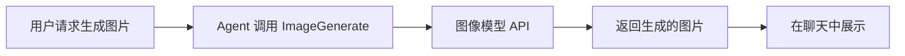

# 应用插件 / App Plugins

应用插件（App Plugins）是 OpenCowork 内置的扩展能力系统，为 Agent 提供图像生成等额外工具。与消息平台插件不同，应用插件直接增强 Agent 的能力，无需外部服务连接。

## 图像生成插件 / Image Plugin

图像生成插件为 Agent 提供 `ImageGenerate` 工具，允许 Agent 根据用户请求生成图片。

### 工作原理

当用户明确要求生成图片、插画、海报、图标或其他视觉内容时，Agent 会自动使用 `ImageGenerate` 工具。

### 配置步骤

#### 1. 配置图像模型

首先需要确保至少有一个支持图像生成的模型可用：

1. 进入 **设置 → AI 提供商**
2. 在提供商的模型列表中，启用支持图像生成的模型（如 DALL·E、Flux 等）
3. 确保模型的分类（category）设置为 `image`

#### 2. 启用图像插件

1. 进入 **设置 → 插件**
2. 找到 **图像生成** 插件
3. 点击开关启用

#### 3. 选择模型来源

图像插件支持两种模型配置方式：

| 模式             | 说明                                         |
| ---------------- | -------------------------------------------- |
| 使用全局图像模型 | 使用在提供商设置中选择的全局图像模型（默认） |
| 自定义模型       | 为图像插件单独指定提供商和模型               |

### ImageGenerate 工具

`ImageGenerate` 工具是图像插件注册的 Agent 工具：

| 参数     | 类型   | 必填 | 说明                               |
| -------- | ------ | ---- | ---------------------------------- |
| `prompt` | string | ✅   | 图像生成提示词，描述期望的视觉效果 |
| `count`  | number | ❌   | 生成数量，默认 1，最多 4           |

#### 使用示例

在聊天中，你可以这样请求 Agent 生成图片：

- "帮我画一只在月光下奔跑的狼"
- "生成一张现代简约风格的 Logo"
- "创建 4 张不同风格的头像"

Agent 会将你的请求转化为详细的视觉描述提示词，调用图像模型生成图片，并在聊天中直接展示结果。

<Callout type="info">
  `ImageGenerate` 工具不需要用户审批，启用后 Agent 可以直接调用。只有当用户明确要求生成图片时，Agent
  才会使用此工具。
</Callout>

### 技术细节

#### 插件注册机制

应用插件使用与消息平台插件类似的动态注册机制：

- 插件启用且有效图像模型可用时，自动注册 `ImageGenerate` 工具
- 插件禁用或图像模型不可用时，自动注销工具
- 应用启动时自动检测并更新工具注册状态

#### 状态管理

插件配置通过 `app-plugin-store` 持久化存储，包括：

- 启用/禁用状态
- 模型来源选择（全局 / 自定义）
- 自定义提供商和模型 ID

#### 图像生成流程

1. Agent 调用 `ImageGenerate` 工具，传入提示词和数量
2. 工具根据配置解析目标图像模型提供商
3. 通过提供商 API 发送图像生成请求
4. 接收 `image_generated` 流事件，获取生成的图片
5. 将图片作为 `ImageBlock` 返回，展示在聊天界面中

如果生成过程中出现错误（超时、网络问题、API 错误等），工具会返回错误信息，Agent 可以据此向用户解释失败原因。
