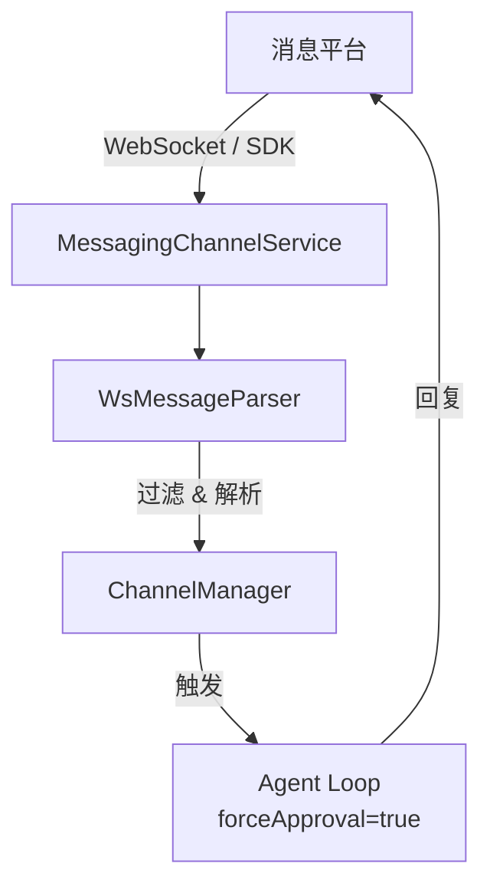

# 插件系统概述 / Plugin System Overview

消息平台插件让 OpenCowork 能够连接主流聊天平台，把外部消息流接入本地 Agent。

## 架构 / Architecture



## 管理方式 / Channel Registry

`ChannelManager` 使用工厂模式管理各个平台服务：

```typescript
channelManager.registerFactory('feishu-bot', createFeishuService)
channelManager.registerFactory('dingtalk-bot', createDingTalkService)
channelManager.registerFactory('telegram-bot', createTelegramService)
channelManager.registerParser('telegram-bot', parseTelegramWsMessage)
```

- 工厂负责创建平台服务实例
- Parser 负责把原始 WebSocket 帧转换成标准消息
- `ChannelManager` 统一负责 start / stop / restart / status

## 传输层 / Transport

大多数平台服务基于 `BasePluginService` 或 SDK 封装实现：

- 自动重连（指数退避）
- 心跳保活
- 断线缓存与恢复
- 平台级消息标准化

飞书使用官方 Lark SDK；钉钉使用 `dingtalk-stream`；其余平台按各自协议适配。

## 自动回复机制 / Auto-Reply

收到消息后，服务会把事件送入自动回复流水线，再由 Agent 生成回复：

```typescript
await runAgentLoop({
  messages: [userMessage],
  forceApproval: true,
  sessionId: pluginSessionId
})
```

`forceApproval` 模式下，Agent 可以无需用户确认地执行工具操作，因此插件配置需要保持可信。

## 插件工具 / Plugin Tools

平台启用时会动态注册专属工具，例如发送消息、获取群组信息、登录授权等。插件禁用时自动注销这些工具。

## 支持的平台 / Supported Platforms

| 平台 | 文档 |
| --- | --- |
| 飞书 | [飞书集成](/docs/plugins/feishu) |
| 钉钉 | [钉钉集成](/docs/plugins/dingtalk) |
| QQ | [QQ 机器人集成](/docs/plugins/qq) |
| 个人微信 | [个人微信接入](/docs/plugins/weixin-personal) |
| Telegram | [Telegram 集成](/docs/plugins/telegram) |
| Discord | [Discord 集成](/docs/plugins/discord) |
| WhatsApp | [WhatsApp 集成](/docs/plugins/whatsapp) |
| 企业微信 | [企业微信集成](/docs/plugins/wecom) |
