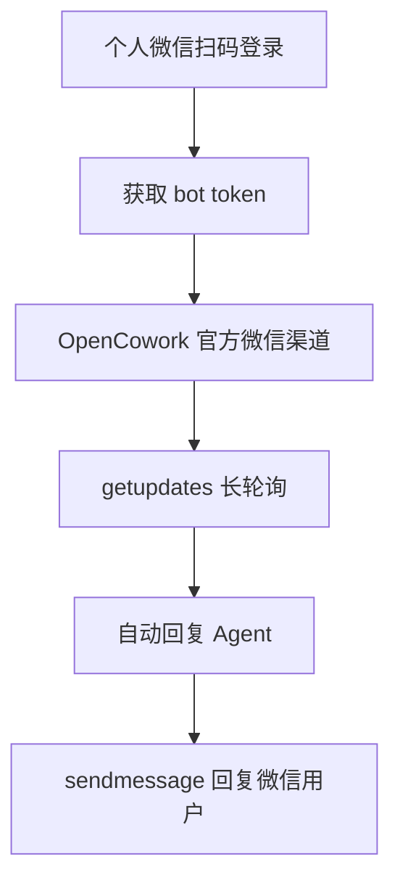
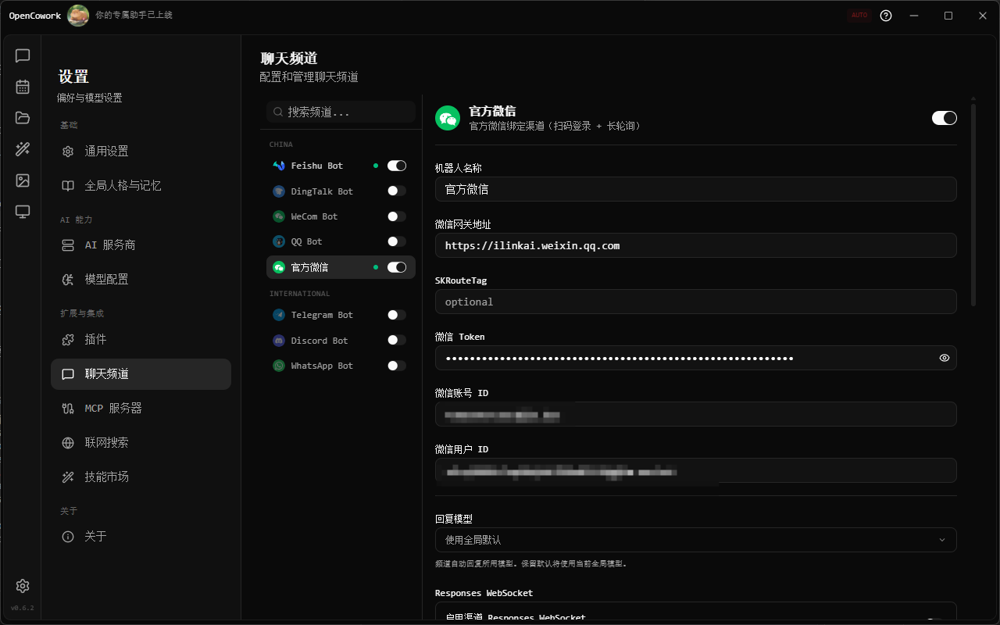
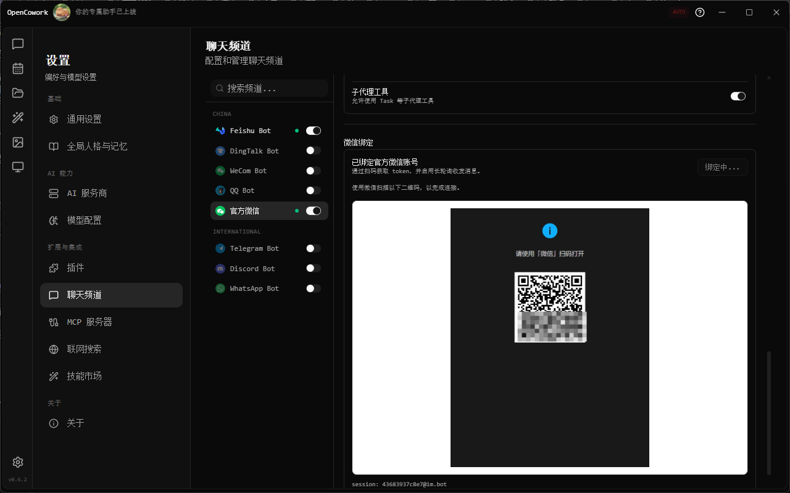
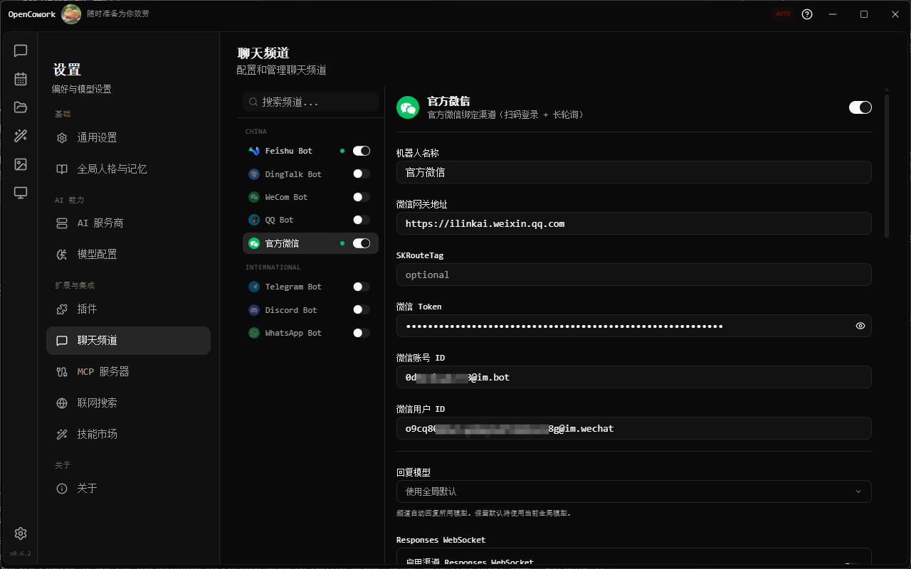
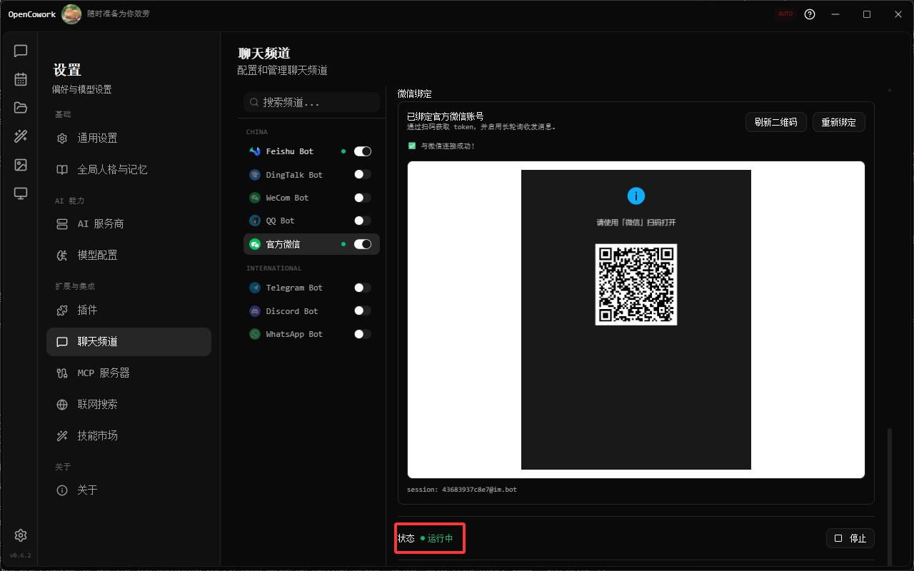

# 个人微信接入 / Personal Weixin Integration

OpenCowork 现在支持把**个人微信账号**接入到聊天频道里，通过扫码完成绑定，然后使用长轮询收发消息。

> [!important]
> 这篇教程对应的是**个人微信扫码绑定**方案，不是微信公众号、服务号、订阅号，也不是企业微信应用接入。

## 适用场景 / When to Use

适合以下需求：

- 你希望用自己的个人微信号收发 AI 回复
- 你希望把微信私聊消息接入 OpenCowork 的 Agent 能力
- 你希望在 OpenCowork 内统一管理聊天渠道，而不是单独维护网页端机器人

不适合以下需求：

- 微信公众号自动回复
- 企业微信应用消息
- 面向公开用户的大规模消息触达

## 工作原理 / How It Works

整体链路如下：



这个渠道不是通过 Webhook 推送，而是：

1. 在 OpenCowork 里点击“绑定微信”
2. 生成二维码
3. 你用微信扫码确认登录
4. OpenCowork 保存 `token / accountId / userId`
5. 渠道启动后通过 `getupdates` 长轮询获取新消息
6. 回复消息时通过 `sendmessage` 发回微信

## 前置要求 / Prerequisites

开始之前，请确认：

1. 你已经安装并启动 OpenCowork
2. 你的 OpenCowork 版本包含“官方微信”聊天频道
3. 你的机器可以访问默认微信网关地址：`https://ilinkai.weixin.qq.com`
4. 你准备用自己的**个人微信**扫码绑定

## 配置步骤 / Setup

### 1. 打开聊天频道页面

进入：

**设置 → 聊天频道 → 官方微信**

在左侧 `China` 分组里选择 `官方微信`。


> 位置：OpenCowork 设置页左侧导航 + 聊天频道列表中选中“官方微信”的截图

### 2. 确认默认网关地址

`官方微信` 渠道默认会使用：

```text
https://ilinkai.weixin.qq.com
```

通常你**不需要手动填写**微信网关地址。

只有在你有自建或特殊转发网关时，才需要修改 `baseUrl`。

可选配置项说明：

| 配置项 | 是否必填 | 说明 |
| --- | --- | --- |
| `baseUrl` | 否 | 微信网关地址，默认使用官方地址 |
| `routeTag` | 否 | 某些环境下用于路由分流 |
| `token` | 否 | 扫码成功后自动写入 |
| `accountId` | 否 | 扫码成功后自动写入 |
| `userId` | 否 | 扫码成功后自动写入 |


### 3. 点击“绑定微信”

在 `微信绑定` 区块中点击：

**绑定微信**

OpenCowork 会向微信网关请求二维码，并在设置页中显示扫码区域。

如果返回的是扫码网页，OpenCowork 会自动转换为本地可显示的二维码截图，不需要你手动打开外部页面。



> 位置：点击“绑定微信”后显示二维码的截图

### 4. 用个人微信扫码确认

使用你的微信 App 扫描二维码，并在手机上完成确认。

成功后，OpenCowork 会自动拿到并保存：

- `token`
- `accountId`
- `userId`

同时页面状态会从“未绑定官方微信账号”变成“已绑定官方微信账号”。



### 5. 启动官方微信渠道

绑定完成后，点击页面底部的：

**启动**

启动后，OpenCowork 会开始执行：

- `getupdates` 长轮询收消息
- 自动把微信私聊消息送进 Agent 自动回复链路
- 使用 `sendmessage` 发回回复内容



> 位置：渠道状态从“已停止”切换到“运行中”的截图

### 6. 测试消息收发

现在你可以用另一个微信账号，向已绑定的微信号发送消息进行测试。

建议先测试：

- 简短文本消息
- 连续两三轮对话
- 稍长一点的问题，确认自动回复正常返回

## 使用说明 / Usage Notes

### 当前支持能力

当前官方微信渠道更适合做**私聊自动回复**，已覆盖：

- 文本消息接收
- 图片消息接收（自动下载并转为多模态图片输入）
- 基于上下文的文本回复
- OpenCowork 自动回复链路接入
- 账号绑定信息持久化

### 当前限制

这套个人微信接入有几个你需要提前知道的限制：

#### 1. 不是公众号方案

它不是公众号客服接口，也不是微信开放平台消息推送方案。

如果你的目标是：

- 公众号菜单
- 模板消息
- 关注后自动回复
- 面向大量用户的公开服务

那么应该走公众号/服务号的另一套实现。

#### 2. 回复依赖上下文令牌

官方微信渠道在回复时依赖服务端返回的 `context_token`。

这意味着：

- 已经发生过对话的私聊可以正常回复
- 没有上下文的陌生会话，不适合直接主动发送首条消息

#### 3. 当前以私聊为主

目前更适合个人微信私聊消息场景。当前已支持图片消息接收；群聊与更多复杂媒体能力仍不属于这篇教程的主线能力。

#### 4. 二维码展示依赖本地渲染

如果二维码在页面里没有显示出来，通常不是微信接口失效，而是：

- 远程扫码页被前端 CSP 拦截
- 或页面尚未刷新到最新版本

这时通常重启 OpenCowork 后重新点击“绑定微信”即可。

## 常见问题 / FAQ

### Q: 为什么我没有看到“官方微信”渠道？

**A:** 请检查：

1. 你是否使用包含该渠道的 OpenCowork 版本
2. 是否已经重启应用，让内建渠道自动写入本地配置
3. 是否在 **设置 → 聊天频道** 页面查看，而不是旧的插件页

### Q: 为什么还提示填写微信网关地址？

**A:** 正常情况下不需要。默认会使用：

```text
https://ilinkai.weixin.qq.com
```

如果你仍看到必填提示，说明当前运行的应用还没有加载到最新逻辑，重启应用即可。

### Q: 二维码显示空白，但浏览器可以打开扫码页，怎么办？

**A:** 这是典型的前端 CSP 限制问题。新版实现会在主进程中把二维码页面转换成本地图片再显示；如果你看到空白，优先重启应用后重试。

### Q: 绑定成功了，但消息发不出去？

**A:** 一般优先检查：

1. 渠道是否已经点击“启动”
2. 是否已经有过一轮有效会话（用于建立 `context_token`）
3. 日志里是否有 `getupdates` 或 `sendmessage` 错误

### Q: 这个方案支持群聊吗？

**A:** 当前教程和当前系统实现以**个人微信私聊自动回复**为主。群聊和复杂媒体能力需要后续扩展。